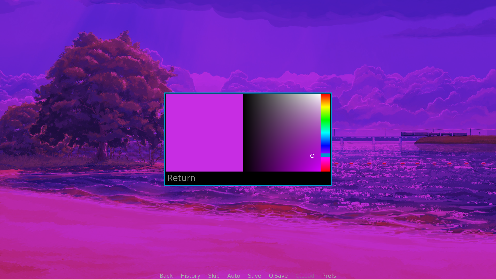

# Ren'Py shader collection

## Available shaders:
* Waves ([Code](game/shaders/waves.rpy) | [Demo](game/demos/waves.rpy))

 Usage:
```
TODO
```
* Color picker ([Code](game/shaders/color_picker.rpy) | [Demo](game/demos/color_picker.rpy))



Usage:
```python
default color = Color(rgb=(.33, .0, .33))
screen test_color_picker:
    use color_picker(
        VariableSimpleValue('color')
    )
```
Also, you can use color picker components(like *SaturationValueRect*, *ColorPickerHueRect*, *collection.color_picker.sat_value_rect* shader, etc) separately